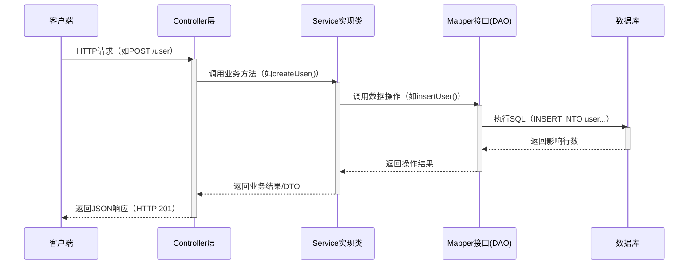
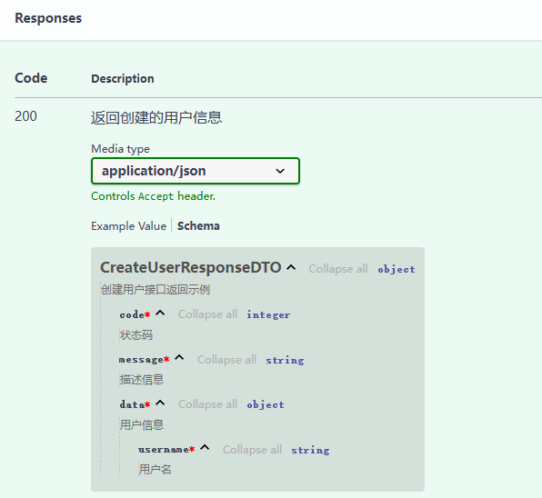
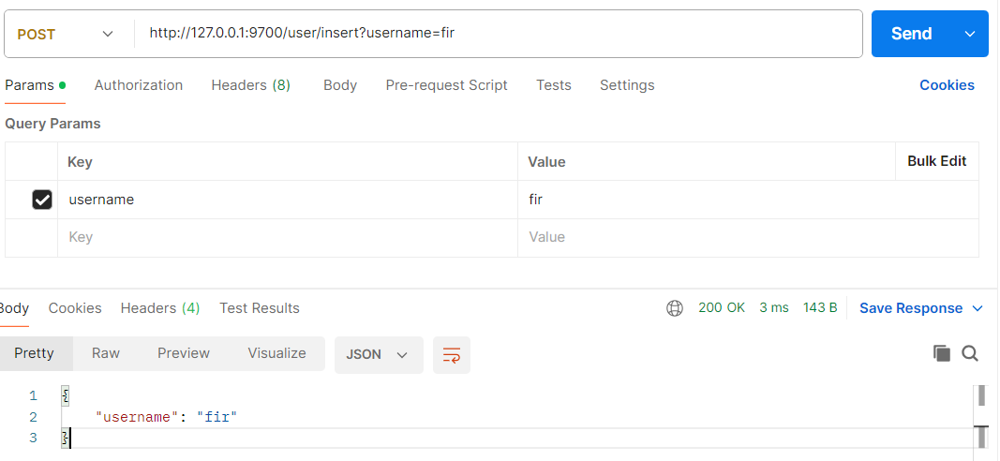

# 业务架构

## 业务流程说明



---

## **关键分层说明**

| 层级            | 示例                      | 说明                                                |
| --------------- | ------------------------- | --------------------------------------------------- |
| **Controller**  | `user_controller.py`      | 接收HTTP请求，调用`Service`接口，不直接接触实现类。 |
| **Service**     | `user_service.py`（接口） | 定义业务逻辑契约，实际由`ServiceImpl`实现。         |
| **ServiceImpl** | `user_service_impl.py`    | 实现业务逻辑，调用`Mapper`接口。                    |
| **Mapper**      | `user_mapper.py`（接口）  | 定义数据操作，自定义实现类实现。                    |
| **MapperImpl**  | `user_mapper_impl.py`     | SQL映射文件，实际执行数据库操作。                   |

## [简单]开发业务接口

创建一个对象，用于接受参数

```python
class CreateUserDTO(BaseModel):
    """
    创建用户
    """
    username: str = Field(description="用户名")
    
class CreateUserResponseDTO(BaseModel):
    """
    创建用户接口返回示例
    """
    code: int = Field(description="状态码")
    message: str = Field(description="描述信息")
    data: CreateUserDTO Field(description="用户信息")
```

同时，为了方便前后端开发，我们需要使用**response_model**指明我们的返回参数以及注释**response_description**

```python

from fastapi import APIRouter, Body, Query
from src.config.result.api_result import ApiResult
from src.dto.user import CreateUserResponseDTO, CreateUserDTO

user_router = APIRouter(prefix="/user", tags=["用户管理"])


@user_router.post(
    "/insert",
    summary="创建用户",
    description="通过提供用户名、邮箱和是否激活状态，创建一个新的用户。",
    response_description="返回创建的用户信息。",
    response_model=CreateUserResponseDTO,
)
async def create_user(create_user_dto: CreateUserDTO = Body(description="创建用户")):
    return ApiResult.success(data=create_user_dto)


@user_router.get(
    "get/insert",
    summary="创建用户",
    description="通过提供用户名、邮箱和是否激活状态，创建一个新的用户。",
    response_description="返回创建的用户信息。",
    response_model=CreateUserResponseDTO,
)
async def create_user(username: str = Query( description="用户名")):
    create_user_dto = CreateUserDTO(
        username=username,
    )
    return ApiResult.success(data=create_user_dto)
```

设置好**response_model**与**response_description**后，我们将在接口文档中有如下显示



user_router还需要加载到FastAPI中，如下所示

```python
def create_app():
    # 构建服务器
    app = FastAPI(title="杉极简", version="0.0.1",
                  dependencies=dependencies_all
                  )
    # 控制层
    app.include_router(user_router)
```

启动项目，即可调用



## [进阶]完整开发业务接口

### 创建dao实体类

对应数据库中的一张表

```
src\entity\user.py
```

如果已经创建了models.py，则从其中再添加一个类。

```python
from tortoise import fields
from tortoise.models import Model


class User(Model):
    """
    用户表
    """
    id = fields.IntField(pk=True, description='主键编号')
    username = fields.CharField(max_length=50, null=True, description='用户登录名')

    class Meta:
        table = "user"
        table_description = "用户表"

```

### 创建控制层文件

```
src\api\v1\user_controller.py
```

```python
from fastapi import APIRouter, Depends, Body

from src.config.result.api_result import ApiResult
from src.dto.user import CreateUserDTO
from src.mapper.impl.user_mapper_impl import UseMapperImpl
from src.mapper.user_mapper import UserMapper
from src.service.impl.user_service_impl import UserServiceImpl
from src.service.user_service import UserService

user_router = APIRouter(prefix="/user", tags=["用户管理"])

# 通过依赖注入返回服务实例
def get_user_service() -> UserService:
    return UserServiceImpl()

# 依赖注入函数，返回 UserMapper 的实现
def get_user_mapper() -> UserMapper:
    return UseMapperImpl()  # 返回 UserMapper 的实现

@user_router.post(
    "/insert",
    summary="创建用户",
    description="通过提供用户名、邮箱和是否激活状态，创建一个新的用户。",
    response_description="用户信息",
)
async def create_user(
        create_user_dto: CreateUserDTO = Body(description="创建用户"),
        user_service: UserService = Depends(get_user_service),
        user_mapper: UserMapper = Depends(get_user_mapper)):
    user = await user_service.create_user(create_user_dto=create_user_dto, user_mapper=user_mapper)
    return ApiResult.success(data=user)
```

### 创建接口类

```
src\service\user_service.py
```

```python
from abc import ABC, abstractmethod
from src.dto.user import CreateUserDTO
from src.entity.user import User
from src.mapper.user_mapper import UserMapper


class UserService(ABC):
    """
    用户接口
    """

    @abstractmethod
    async def create_user(self, create_user_dto: CreateUserDTO, user_mapper: UserMapper) -> User:
        """
        创建一个新用户。

        :param create_user_dto: 用户信息
        :param user_mapper: 用户dao层
        :return: 用户对象
        """
        pass
```

### 创建接口实现

```
src\service\impl\user_service_impl.py
```

```python
from abc import ABC
from src.dto.user import CreateUserDTO
from src.entity.user import User
from src.mapper.user_mapper import UserMapper
from src.service.user_service import UserService


class UserServiceImpl(UserService, ABC):
    """
    用户实现层
    """

    async def create_user(self, create_user_dto: CreateUserDTO, user_mapper: UserMapper
                          ) -> CreateUserDTO:
        """
        创建一个新用户。

        :param create_user_dto: 用户信息
        :param user_mapper: 用户dao层
        :return: 用户对象
        """
        user = await User.create(username=create_user_dto.username, password=create_user_dto.password)
        user_department_dto  = await user_mapper.get_user_department(user.id)
        create_user = CreateUserDTO(
            username=create_user_dto.username,
            department_name=user_department_dto.department_name,
        )
        return create_user
```

### 创建数据接口类

```
src\mapper\user_mapper.py
```

```python
from abc import ABC, abstractmethod

from src.dto.user_department_dto import UserDepartmentDTO


class UserMapper(ABC):
    """
    用户接口
    """

    @abstractmethod
    async def get_user_department(self, user_id: int) -> UserDepartmentDTO:
        """
        获取用户部门信息

        :param user_id: 用户id
        :return: 用户部门信息
        """
        pass
```

### 创建数据接口实现类文件

```
src\mapper\impl\user_mapper_impl.py
```

```python
from tortoise import Tortoise
from src.dto.user_department_dto import UserDepartmentDTO
from src.mapper.user_mapper import UserMapper


class UseMapperImpl(UserMapper):
    """
    用户实现层
    """

    async def get_user_department(self, user_id: int) -> UserDepartmentDTO:
        """
        用户对象
        """
        # SQL 查询语句
        query = """
        SELECT
            u.id AS user_id,
            u.username,
            d.code AS department_code,
            d.name AS department_name
        FROM
            user u
        LEFT JOIN
            department d
        ON
            u.department_code = d.code
        WHERE
            u.id = %s
        """

        # 执行 SQL 查询并获取结果
        connection = Tortoise.get_connection("default")
        results = await connection.execute_query_dict(query, [user_id])
        user_department_data = None
        if results:
            # 将查询结果映射到 Pydantic 数据模型
            user_department_data = UserDepartmentDTO(**results[0])  # 只取第一个结果（假设每个用户名唯一）
        return user_department_data
```
