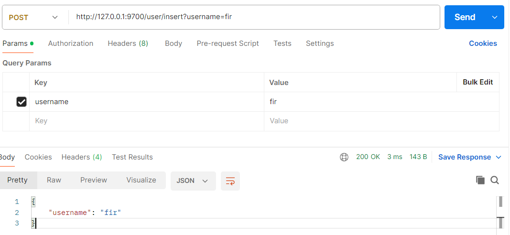
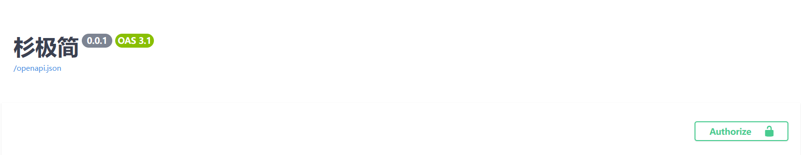
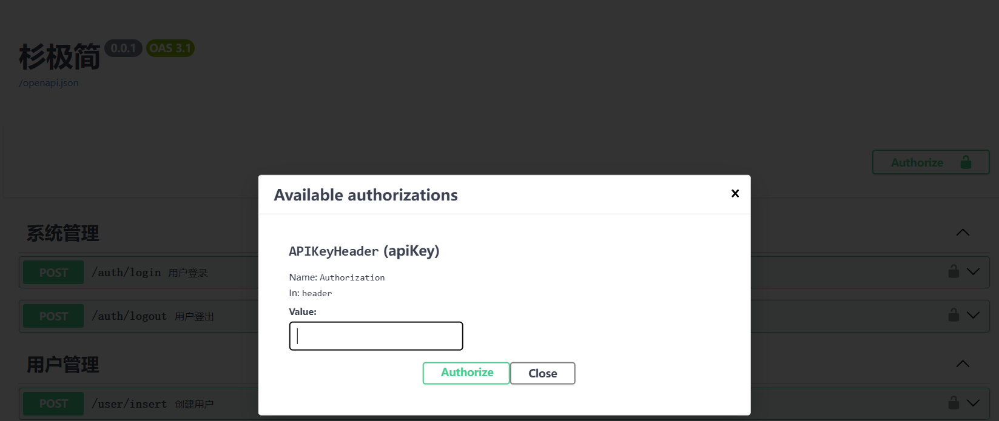

# 命名约定

在 Python 中，通常推荐使用 **小写字母和下划线**（snake_case）作为命名约定，而不是 Java 中常用的 **大驼峰命名**（CamelCase）。这是 Python 的 **PEP 8** 风格指南的推荐做法，它规定了 Python 代码的命名习惯。

## Python 常见的命名约定：

1. **类名**：使用大驼峰命名（CamelCase）。
   - 例如：`UserService`，`MySQLUserService`。
2. **函数名和方法名**：使用小写字母和下划线（snake_case）。
   - 例如：`create_user()`，`get_all_users()`。
3. **变量名**：使用小写字母和下划线（snake_case）。
   - 例如：`user_service`，`user_id`。
4. **常量**：使用全大写字母和下划线（UPPERCASE_WITH_UNDERSCORES）。
   - 例如：`MAX_RETRIES`，`API_URL`。

# 开发

## 开发接口

### 创建一个简单的服务

```python
from fastapi import APIRouter, Query, Depends
from src.config.result.api_result import ApiResult
from src.service.impl.user_service_impl import UserServiceImpl
from src.service.user_service import UserService

user_router = APIRouter(prefix="/user", tags=["用户管理"])


@user_router.post(
    "/insert"
)
async def create_user(username: str,
                      email: str,
                      is_active: bool),


user_service: UserService = Depends(get_user_service)):
user = await user_service.create_user(username=username, email=email, is_active=is_active)
return ApiResult.success(data=user)
```

```python
def create_app():
    # 拦截器
    dependencies_all = dependencies.all_dependencies()

    # 构建服务器
    app = FastAPI(title="杉极简", version="0.0.1",
                  dependencies=dependencies_all
                  )
    # 控制层
    app.include_router(user_router)
```

启动项目，即可调用



### 完善

### 创建实体类

```
src\entity\models.py
```

如果已经创建了models.py，则从其中再添加一个类。

```python
from tortoise import fields
from tortoise.models import Model


class User(Model):
    id = fields.IntField(pk=True)
    username = fields.CharField(max_length=50)
    email = fields.CharField(max_length=100)
    is_active = fields.BooleanField(default=True)

```

#### 创建控制层文件

```
src\api\v1\user_controller.py
```

```python
from fastapi import APIRouter, Query, Depends
from src.config.result.api_result import ApiResult
from src.service.impl.user_service_impl import UserServiceImpl
from src.service.user_service import UserService

user_router = APIRouter(prefix="/user", tags=["用户管理"])


# 通过依赖注入返回服务实例
def get_user_service() -> UserService:
    return UserServiceImpl()


@user_router.post(
    "/insert",
    summary="创建用户",
    description="通过提供用户名、邮箱和是否激活状态，创建一个新的用户。",
    response_description="返回创建的用户信息。",
)
async def create_user(username: str = Query(None, description="用户的唯一用户名"),
                      email: str = Query(..., description="用户的邮箱地址"),
                      is_active: bool = Query(..., description="用户是否激活，默认为True"),
                      user_service: UserService = Depends(get_user_service)):
    user = await user_service.create_user(username=username, email=email, is_active=is_active)
    # 使用统一返回值
    return ApiResult.success(data=user)
```

#### 创建接口类

```
src\service\user_service.py
```

```python
from abc import ABC, abstractmethod
from src.entity.user import User


class UserService(ABC):
    """
    用户接口
    """

    @abstractmethod
    async def create_user(self, username: str, email: str, is_active: bool) -> User:
        """
        创建一个新用户。

        :param username: 用户名
        :param email: 邮件地址
        :param is_active: 激活状态
        :return: 用户对象
        """
        pass
```

#### 创建接口实现

```
src\service\impl\user_service_impl.py
```

```python
from src.entity.user import User
from src.service.user_service import UserService


class UserServiceImpl(UserService):
    """
    用户实现层
    """

    async def create_user(self, username: str, email: str, is_active: bool = True) -> User:
        """
        创建一个新用户。

        :param username: 用户名
        :param email: 邮件地址
        :param is_active: 激活状态
        :return: 用户对象
        """
        user = await User.create(username=username, email=email, is_active=is_active)
        return user

```

#### 创建数据接口类

```
src\mapper\user_mapper.py
```

```python
from abc import ABC, abstractmethod

from src.dto.user_department_dto import UserDepartmentDTO


class UserMapper(ABC):
    """
    用户接口
    """

    @abstractmethod
    async def get_user_department(self, user_id: int) -> UserDepartmentDTO:
        """
        获取用户部门信息

        :param user_id: 用户id
        :return: 用户部门信息
        """
        pass

```

#### 创建数据接口实现类文件

```
src\mapper\impl\user_mapper_impl.py
```

```python
from tortoise import Tortoise
from src.dto.user_department_dto import UserDepartmentDTO
from src.mapper.user_mapper import UserMapper


class UseMapperImpl(UserMapper):
    """
    用户实现层
    """

    async def get_user_department(self, user_id: int) -> UserDepartmentDTO:
        """
        用户对象
        """
        # SQL 查询语句
        query = """
        SELECT
            u.id AS user_id,
            u.username,
            d.code AS department_code,
            d.name AS department_name
        FROM
            user u
        LEFT JOIN
            department d
        ON
            u.department_code = d.code
        WHERE
            u.id = %s
        """

        # 执行 SQL 查询并获取结果
        connection = Tortoise.get_connection("default")
        results = await connection.execute_query_dict(query, [user_id])
        user_department_data = None
        if results:
            # 将查询结果映射到 Pydantic 数据模型
            user_department_data = UserDepartmentDTO(**results[0])  # 只取第一个结果（假设每个用户名唯一）
        return user_department_data
```

## 框架

### 启动类文件

```python
import argparse
import os

import uvicorn
from dotenv import load_dotenv
from src.api.server_app import fir_app
from src.config.initialize.initialize_utils import initialize_trigger
from src.config.initialize.launch_title import start


def main():
    """
    项目启动方法
    """
    # 创建 ArgumentParser 对象
    parser = argparse.ArgumentParser(description="Example script to demonstrate command line arguments.")
    # 添加参数
    parser.add_argument('--active', type=str)
    # 解析命令行参数
    args = parser.parse_args()

    start()
    # 执行项目启动前的初始化
    initialize_trigger()
    env_active = args.active
    if env_active is None:
        env_active = "dev"
    env_file = f'src/resources/{env_active}.env'

    if os.path.exists(env_file):
        load_dotenv(env_file)
        server_port = os.environ.get('SERVER_PORT')
        server_port = int(server_port)
        uvicorn.run(fir_app, host="0.0.0.0", port=server_port, log_config="src/resources/uvicorn_config.json",
                    use_colors=True,
                    loop="asyncio",
                    )
    else:
        raise Exception(".启动失败--env配置文件不存在")


if __name__ == "__main__":
    # 启动主程序方法
    main()

```

uvicorn_config.json配置系统日志框架输出。

### 配置文件

```
load_dotenv(env_file)
```

文件位置：src/resources/dev.env

```
DATABASE_URL=mysql://127.0.0.1:3306/fir_fast
DATABASE_USER=root
DATABASE_PASSWORD=123456
```

在系统中进行调用

```
import os

DATABASE_URL = os.environ.get('DATABASE_URL')
print(DATABASE_URL)
```

可以通过不同的启动参数选择配置文件

```
python application.py --active test
```


### 拦截器

```
    # 构建服务器
    app = FastAPI(title="杉极简", version="0.0.1",
                  dependencies=dependencies_all
                  )
```

#### token拦截器

#### swagger页面使用Authorization请求头

使得swagger页面使用Authorization请求头，需要进行如下设置，之后就可以在页面输入token。

```
from fastapi.security import APIKeyHeader
from fastapi import Depends, Request, Security

api_token_key = APIKeyHeader(name='Authorization', auto_error=False)

async def verify_token(request: Request, Authorization=Security(api_token_key)):
```





#### 完整代码

```python
import os

from fastapi import Depends, Request, Security
from fastapi.security import APIKeyHeader
from src.common.global_exception_handler import DescriptionException
from src.config.result.api_code import ApiCode
from src.config.sys.cache_utils import cache

api_token_key = APIKeyHeader(name='Authorization', auto_error=False)


async def verify_token(request: Request, Authorization=Security(api_token_key)):
    """
    token拦截器
    :param Authorization: 请求令牌
    :param request: 请求头
    :return: 通过/拦截返回401
    """

    # 生产环境下，应开启token拦截器
    jwt_filter = os.getenv('JWT_FILTER', 'false').lower() == 'true'
    if not jwt_filter:
        return None

    if request.url.path == "/auth/login":
        return None

    if not Authorization:
        raise DescriptionException(ApiCode.ACCESS_DENIED)
    user = cache.get(Authorization)

    if not user:
        raise DescriptionException(ApiCode.ACCESS_DENIED)

    return Authorization


def all_dependencies():
    """
    请求拦截器
    1.处理token
    :return:
    """
    return [Depends(verify_token)]

```


### 全局异常处理器

```
    # 注册异常处理器
    global_exception_handler.exception_register(app)
```

实现方式

```python
import logging

from fastapi import FastAPI

from src.config.result.api_result import ApiResult
from src.config.result.api_code import ApiCode

log = logging.getLogger("uvicorn")


class DescriptionException(Exception):
    """
    自定义异常-登录超时
    """

    def __init__(self, api_code: ApiCode):
        message = api_code.description
        code = api_code.code
        self.code = code
        self.message = message
        super().__init__(code, message)


def exception_register(app: FastAPI):
    """
    异常处理注册
    """
    app.exception_handler(DescriptionException)(description_exception)
    app.exception_handler(Exception)(exception_handler)


async def description_exception(request, exc):
    """
    自定义异常处理器-通用
    :param request: 请求
    :param exc: 异常描述
    :return: 统一返回值
    """
    log.error(f"通用自定义异常: {exc}")
    message = str(exc.message) or "请求失败！"
    return ApiResult.fail(code=exc.code, message=message)


async def exception_handler(request, exc):
    """
    默认Exception异常
    :param request: 请求
    :param exc: 异常
    :return: 请求失败描述
    """
    log.error(f"全局异常捕捉: {exc}")
    return ApiResult.fail(code=500, message="请求失败！")

```

### MySQL+TortoiseORM配置

```python
    # 配置 TortoiseORM
    database_url = os.environ.get('DATABASE_URL')
    database_user = os.environ.get('DATABASE_USER')
    database_password = os.environ.get('DATABASE_PASSWORD')
    # 转义密码中的特殊字符
    quoted_user = quote_plus(database_user)
    quoted_password = quote_plus(database_password)
    db_auth = f"mysql://{quoted_user}:{quoted_password}@"
    db_url = database_url.replace("mysql://", db_auth, 1)
    register_tortoise(
        app,
        db_url=db_url,
        # 数据对象
        modules={"entity": [models, department]},
        # 禁用自动生成数据库表
        generate_schemas=False,
        add_exception_handlers=True,
    )
```

### 统一返回值

#### 返回值实体类

```python
from fastapi import status
from fastapi.responses import JSONResponse, Response
from typing import Union
from fastapi.encoders import jsonable_encoder
from pydantic import BaseModel
from tortoise.models import Model


class ApiResult:
    """统一异常返回类"""

    @classmethod
    def success(cls, data: Union[list, dict, str, bool, Model, BaseModel] = None) -> Response:
        """
        通用-请求成功
        :param data:
        :return:
        """
        json_compatible_item_data = jsonable_encoder(data)
        return JSONResponse(
            status_code=status.HTTP_200_OK,
            content={
                'code': 200,
                'message': "请求成功",
                'data': json_compatible_item_data,
            }
        )

    @classmethod
    def fail(cls, code: int = 400,
             message: str = "请求失败",
             data: Union[list, dict, str, Model, BaseModel] = None,
             ) -> Response:
        """
        通用-失败请求返回体
        :param code: 状态码
        :param message: 描述
        :param data: 请求数据
        :return:
        """
        json_compatible_item_data = jsonable_encoder(data)
        return JSONResponse(
            status_code=status.HTTP_400_BAD_REQUEST,
            content={
                'code': code,
                'message': message,
                'data': json_compatible_item_data,
            }
        )

```

#### 状态描述枚举类

```python
from enum import Enum


class ApiCodeCustomEnum(Enum):
    def __init__(self, code: int, description: str):
        self._value_ = code
        self.description = description

    def __str__(self):
        return f"{self.__class__.__name__}.{self.name}: (Code: {self.value}, Description: {self.description})"

    @property
    def code(self):
        return self._value_


class ApiCode(ApiCodeCustomEnum):
    """
    接口返回码
    """
    ACCESS_DENIED = (401, "登录过期!")
    ERROR_USER_PASS = (400, "用户名或密码错误!")

```

#### 应用示例

```python
    async def login(self, username: str, password: str, user_service: UserService) -> UserDto:
        """
        登录

        :param user_service:
        :param username: 用户名
        :param password: 用户密码
        :return: 用户登录信息
        """
        user = await user_service.get_user_by_username_password(username=username, password=password)
        if user is None:
            raise DescriptionException(ApiCode.ERROR_USER_PASS)
```


# FAQ

##  以一种访问权限不允许的方式做了一个访问套接字的尝试

报错如下，表示端口被占用

```
vicorn main:app --reload
INFO:     Will watch for changes in these directories: 
ERROR:    [WinError 10013] 以一种访问权限不允许的方式做了一个访问套接字的尝试。
```

